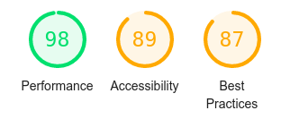

# Desafio da previsão do tempo

Neste desafio buscamos desenvolver uma aplicação simples utilizando a api [HG Weather](https://hgbrasil.com/status/weather), use qualquer tecnologia que te der na telha, desde que o app seja portável para web ao mínimo.
 
## Instruções

Faça um fork do repositório e crie uma branch com seu nome, nela você coloca seu site.

Após o término se quiser publicar a mesma na branch principal faça um pull request, ou se preferir publique o site para que eu faça a avaliação e coloque ele na lista de pontuação.

## Requisitos

Sua pagina precisa tem uma forma de consulta por cidade, seja ela por seleção ou pesquisa, se quiser adicionar mais funcionalidades como Geolocalização só vai meu filho.

## Publicação

Publique seu site de alguma forma ou envie seu código via pull request para minha branch que faço a publicação por você, coloque uma lista.

## Avaliação

O código será avaliado seguindo como base a sua pontuação no [Lighthouse](https://developers.google.com/web/tools/lighthouse). Os pontos serão baseados na Performance, acessibilidade e melhores práticas, erros no código também serão contados na pontuação como no exemplo abaixo:

Fórmula de cálculo: `(Performance + Acessibilidade + Melhores Práticas) / 3 - números de erros na abertura do site`, lembrando que os erros serão baseados por tipo, ou seja um erro que repete não será contado duas vezes.

## Dicas

- Utilize a api com moderação, se puder armazenar dados já consultados em uma storage, seja ela externa ou dentro do próprio navegador como o [Redux](https://redux.js.org/), vai de sua preferencia.

- Utilize uma biblioteca de template para te guiar na formulação da UI, exemplo [Bootstrap](https://getbootstrap.com/).

- Utilize de qualquer tecnologia para te ajudar no desenvolvimento, mas não se esqueça da performance.

- E por último, se divirta kkk, coloca uns easter egg também se quiser 😁.
